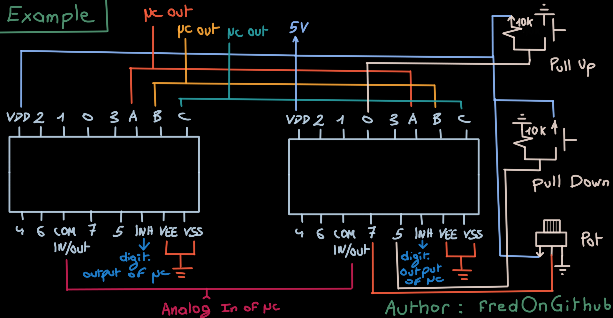

- [Use v2 directly](#use-v2-directly)
  - [2 Modes : hold and direct](#2-modes--hold-and-direct)
- [ARDUINO WITH 2_X_CD4051_INPUT : V1](#arduino-with-2_x_cd4051_input--v1)
  - [From this schematic :](#from-this-schematic-)
  - [Compilation with #define TEST](#compilation-with-define-test)
  - [Compilation without #define TEST](#compilation-without-define-test)
  - [Compilation with #define SERIE](#compilation-with-define-serie)
  - [Compilation without #define SERIE](#compilation-without-define-serie)
  - [Program that helps too](#program-that-helps-too)

# Use v2 directly 
to obtain a simpler program with the intelligence of optimized debouncing management. See https://my.eng.utah.edu/~cs5780/debouncing.pdf (also in documentation).

In v2 **pull up is used and has to be used**. If you use pull down, maybe you'll get.

PULL DOWN non r&eacute;solu car rel&acirc;chement trop vite 1111111111111111 1111111111111111 1111111111111111 1111111111111110 1111111111111100 1111111111111000 1111111111110000 1111111111100001 1111111111000011 1111111110000111 1111111100001111 1111111000011111 1111110000111111 1111100001111111 1111000011111111 1110000111111111 1110001111111111 1110011111111111 1110111111111111 1111111111111111

  and never you'll get the matching  
  1111000000000000 
  because you release the button too quickly

  

PULL UP 1111111111111111 1111111111111111 1111111111111111 1111111111111110 1111111111111100 1111111111111000 1111111111110000 1111111111100000 1111111111000000 1111111110000000 1111111100000000 1111111000000000 1111110000000000 1111100000000000 1111000000000000 
NICE !! and always it gets this matching

With test we get ~40ms : it is good enough.

## 2 Modes : hold and direct

Hold : action begins after complete hold (button free).

Direct : action starting directly when a push is detected (and the time of managing debounce is over).

  

# ARDUINO WITH 2_X_CD4051_INPUT : V1

## From this schematic :

## Compilation with #define TEST
To see the output in a serial consol.

## Compilation without #define TEST
To use the Arduino like a USB controller.

## Compilation with #define SERIE
To use the USB serial controler with "Hailess Midi" and "Loop Midi" (for example).

## Compilation without #define SERIE
To use the Arduino like a USB Midi controller if you have flashed it with "DFU-programmer".
See https://github.com/fredOnGitHub/ARDUINO_EN_USB_MIDI

## Program that helps too
https://htmled.it/editeur-html/ to translate text to html online